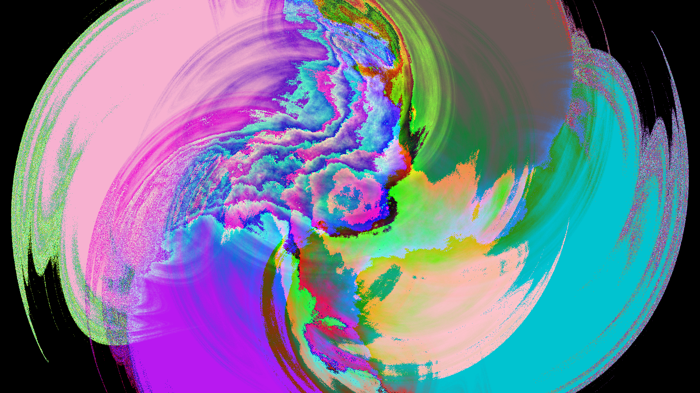

## Фрактальное пламя

Представляет собой программу, которая позволяет генерировать
изображения фрактального пламени на основе идеи Chaos Game.

### Пример генерации:


### Ключевой функционал
* Многопоточный рендеринг: Распределение итераций по пулу потоков для максимальной утилизации CPU и ускорения генерации.
* Тонкая настройка: Полный контроль над процессом генерации через аргументы командной строки (CLI) или внешние файлы конфигурации (JSON).
* Детерминированность: Возможность задать базовое значение (seed) для генератора псевдослучайных чисел, что гарантирует точное воспроизведение понравившихся фракталов.
* Продвинутая цветокоррекция: Использование логарифмического масштабирования тонов (tonemapping) для получения плавных градиентов и устранения засветов.
* Поддержка 9 различных нелинейных искажений пространства.

### Поддерживаемые трансформации
* Система из коробки поддерживает следующие виды математических вариаций для искривления пространства:
* LINEAR
* HEART
* POLAR
* DISC
* SWIRL
* SINUSOIDAL
* SPHERICAL
* SPIRAL
* HANDKERCHIEF

### Описание входных и выходных данных

В качестве входных данных ожидается увидеть следующие параметры:
* `-w`/`--width` - int, ширина итогового изображения, по дефолту - `1920`;
* `-h`/`--height` - int, высота итогового изображения, по дефолту - `1080`;
*  `--seed` - long, начальное значение генератора, по дефолту - `5`;
* `-i`/`--iteration-count` - int, количество итераций генерации, по дефолту - `2500`;
* `-o`/`--output-path` - строка, относительный путь до файла, в который нужно записать изображение в формате `PNG`, по дефолту - `result.png`;
* `-t`/`--threads` - int, количество потоков, по дефолту - `1`;
* `-ap`/`--affine-params` - конфигурация аффинных преобразований, строка формата `<a_1>,<b_1>,<c_1>,<d_1>,<e_1>,<f_1>/<a_N>,<b_N>,<c_N>,<d_N>,<e_N>,<f_N>`, где:
* `a` - масштаб/вращение X, double, например - `0.1`;
* `b` - сдвиг-смешивание X от Y, double, например - `0.1`;
* `c` - сдвиг по X, double, например - `0.1`;
* `d` - смешивание Y от X, double, например - `0.1`;
* `e` - масштаб/вращение Y, double, например - `0.1`;
* `f` - сдвиг по Y, double, например - `0.1`;
* `\` - разделитель каждого из элементов массива преобразований;
* `-f`/`--functions` - строка, конфигурация применяемых методов трансформации формата `<функция_N>:<вес_функции>,<функция_N>:<вес_функции>`, например - `swirl:1.0,horseshoe:0.8`, где:
* `<функция_N>` - название функции, например, `swirl`;
* `<вес_функции>` - вес применяемой трансформации/функции, double, например - `1.0`;
* `--config` - строка, относительный путь до файла конфигурации (необязательный);

Так же входные параметры можно представить в виде JSON файла `config.json`:

```json
{
  "size": {
    "width": 1920, 
    "height": 1080
  },
  "iteration_count": 2500,
  "output_path": "result.png",
  "threads": 4,
  "seed": 2.1324512,
  "functions": [
    {
      "name": "swirl",
      "weight": 1.0
    },
    {
      "name": "horseshoe",
      "weight": 0.7
    }
  ],
  "affine_params": [
    {
      "a": 1.0,
      "b": 1.0,
      "c": 1.0,
      "d": 1.0,
      "e": 1.0,
      "f": 1.0
    },
    {
      "a": 0.3,
      "b": 1.0,
      "c": -0.2,
      "d": 0.4,
      "e": 1.0,
      "f": 1.0
    }
  ]
}
```

Приоритет параметров следующий:
* Консольный ввод;
* JSON-файл;
* Параметры по дефолту;


